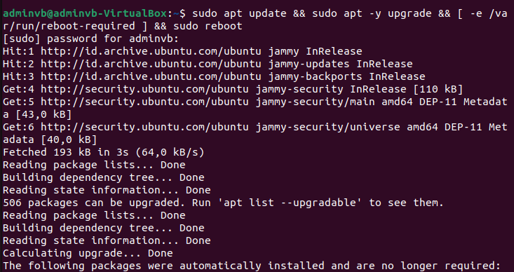
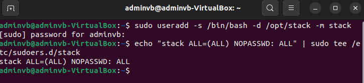
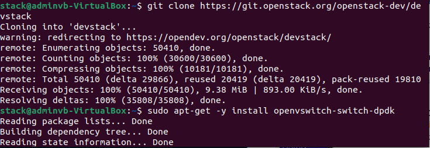
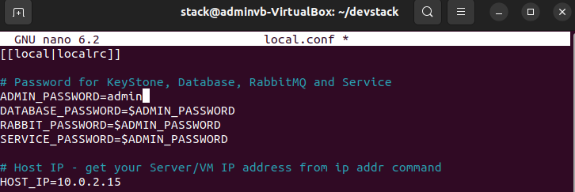
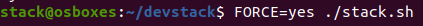
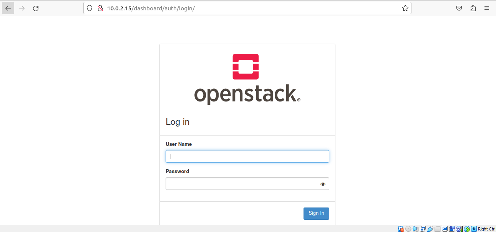
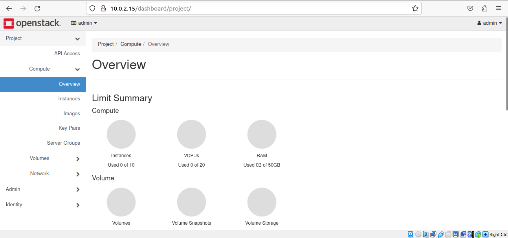
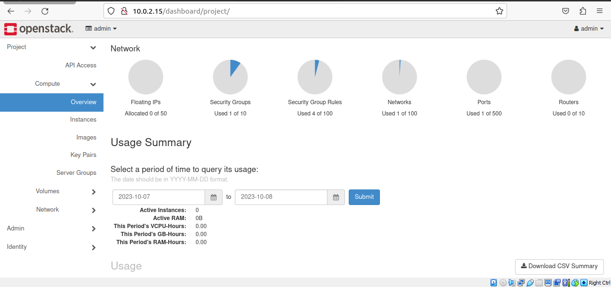

## Latihan
Install DevStack dengan menggunakan petunjuk yang ada di quickstart maupun di artikel ini. Gunakan image Ubuntu 18.04 yang sudah anda siapkan.
- Login to your Ubuntu system – Can be Desktop or VM in the Cloud and update it. Then Reboot it after an upgrade.

- Devstack should be run as a non-root user with sudo enabled. If you’re running your instance in the cloud, standard logins to cloud images such as “centos” or “ubuntu” or “cloud-user” are usually fine. For other installations of Ubuntu 20.04/18.04, run the commands below to create DevStack deployment user.

- Enable sudo privileges for this user without need for a password.

- Clone Destack deployment code from Github.
su - stack
sudo apt -y install git
git clone https://git.openstack.org/openstack-dev/devstack
- Create a local.conf file with 4 passwords and Host IP address
cd devstack
nano local.conf
and add:

- Now that you’ve configured the minimum required config to get started with DevStack, start the installation of Openstack.

- Copy the Horizon URL shown on the installation output and paste it into your web browser. Use the default users demo or admin and configured password to login.

