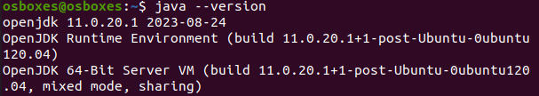
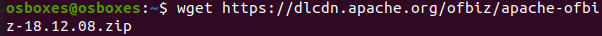
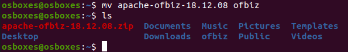
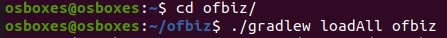
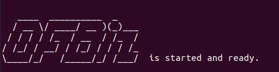
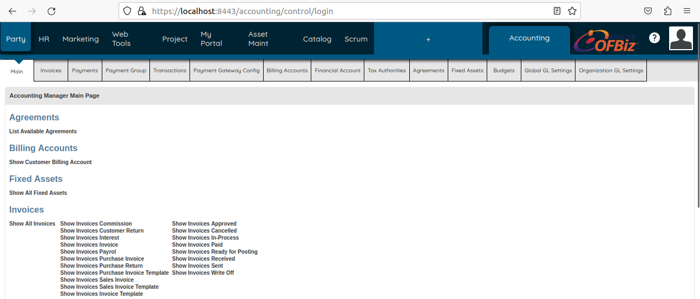

# Install Apache Ofbiz (Ubuntu 20.04)
Pada praktikum minggu ke-5 ini mahasiswa diberikan latihan untuk menginstal software *Apache Ofbiz*, yaitu sebuah open source ERP. Pengerjaan ini menggunakan Ubuntu 20.04 sebagai sistem operasinya.  
  
## Langkah-langkah Instalasi
Pastikan di dalam sistem operasi sudah terinstal java. Untuk mengeceknya gunakan perintah 
`java --version`  
  
Apabila java belum terinstal, instal terlebih dahulu dengan perintah berikut:  

Perintah di atas akan menginstal `openjdk-11` ke dalam sistem.  
  
Setelah instalasi selesai, cek kembali dengan perintah `java --version`.  
  
  
Selanjutnya unduh installer Apache Ofbiz pada tautan [berikut](https://dlcdn.apache.org/ofbiz/apache-ofbiz-18.12.08.zip)  

  
Lakukan *unzip* dengan perintah berikut:  
```
$ unzip apache-ofbiz-18.12.08.zip -d .
```
  
Maka akan muncul direktori installer Apache Ofbiz. Ubah nama direktori menjadi `ofbiz` agar tidak terlalu panjang.  


  
Unduh `gradle-wrapper.jar` dan `gradle-wrapper.properties` melalui tautan di bawah ini:  
- gradle-wrapper.jar: https://github.com/gradle/gradle/blob/v5.0.0/gradle/wrapper/gradle-wrapper.jar
- gradle-wrapper.properties: https://github.com/gradle/gradle/blob/v5.0.0/gradle/wrapper/gradle-wrapper.properties  
  
Setelah itu *copy* kedua file tadi ke dalam direktori `ofbiz/gradle/wrapper/`.  
```
cp gradle-wrapper.jar ofbiz/gradle/wrapper/
cp gradle-wrapper.properties ofbiz/gradle/wrapper/
```

Selanjutnya instal `gradle` dengan perintah:  
```
$ sudo apt install gradle -y
```


Masuk ke dalam direktori `ofbiz` kemudian ketikkan perintah berikut:  
```
./gradlew loadAll ofbiz
```
  
  
Sistem akan melakukan proses unduh. Kemudian sistem akan menjalankan *gradle daemon* sekaligus service Apache Ofbiz.  
Service Apache Ofbiz telah berjalan ditandai dengan tampilan seperti berikut di terminal:  
  
  
Lakukan pengecekan dengan mengakses halaman https://localhost:8443/accounting.  
Login menggunakan username *admin* dan password *ofbiz*. Setelah berhasil login kita akan diarahkan ke halaman *Accounting* - *Main*.  
  
  
Lakukan pengecekan juga dengan mengakses halaman https://localhost:8443/ecommerce.  
  
  
Selesai.