# Panduan Berbelanja di Ofbiz E-Commerce
Pada tugas ini, mahasiswa diminta membuat panduan berbelanja di Ofbiz E-commerce
## Registrasi Member
Pertama, akses e-commerce melalui halaman https://localhost:8443/ecommerce.  
  
Kemudian pilih menu *Register*.  
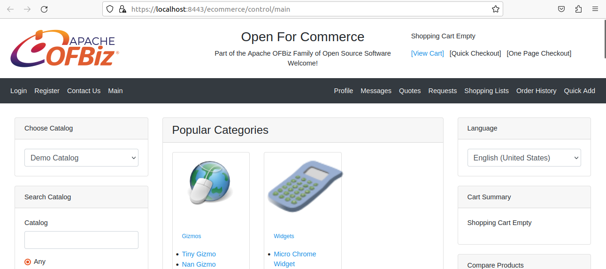  
  
Lakukan pengisian data diri.  
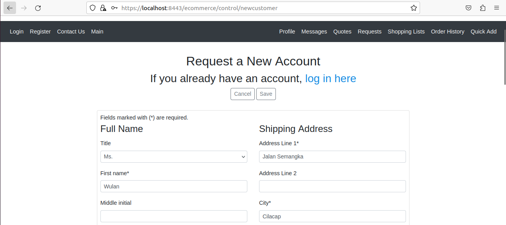  
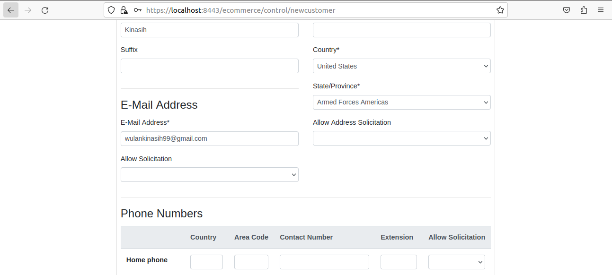
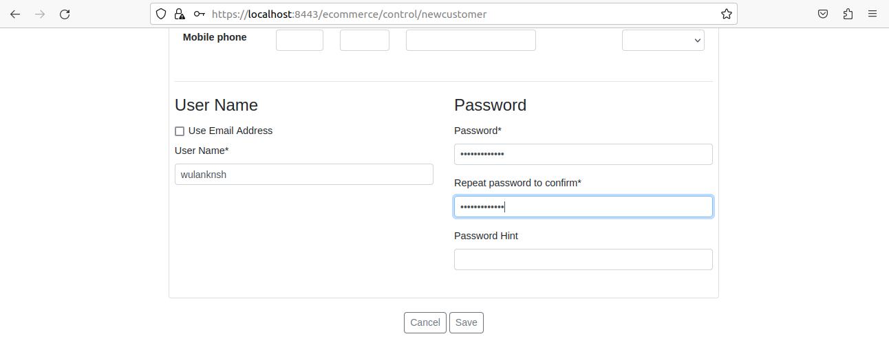     
Klik *Save* untuk memproses registrasi.  
  
Jika berhasil, Anda akan dialihkan ke halaman beranda E-Commerce.  
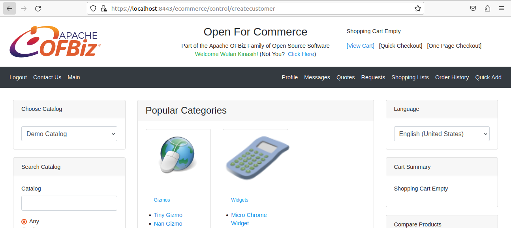  
  
## Menambahkan Barang ke Keranjang
Cari barang yang ingin Anda beli. Anda dapat melakukan pencarian melalui *__Search Catalog__* atau mencari produk melalui bagian *__Categories__*.  
Misalkan Anda ingin membeli sebuah *Widgets*. Maka pada bagian *__Categories__*, klik pilihan *Widgets*, kemudian klik pilihan *Mini Widgets en* lalu pilih *Micro Widgets*.  
Akan ditampilkan daftar produk pada kategori tersebut. Misalkan Anda ingin membeli produk *Micro Chrome Widget*. Maka klik tombol *__Add to Cart__* yang ada di bawahnya.  
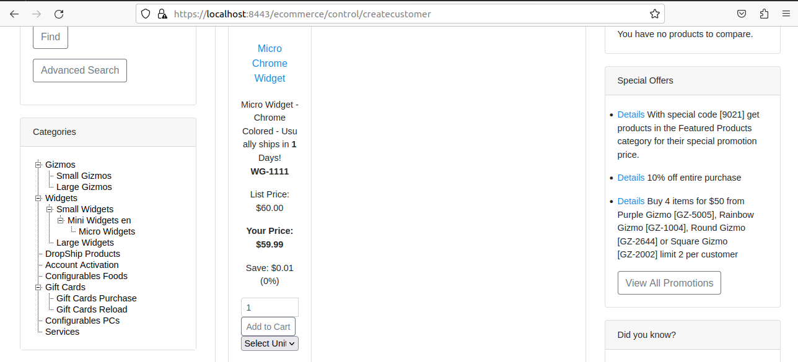  
  
Maka barang yang telah dipilih tadi akan masuk ke *__Cart Summary__*.  
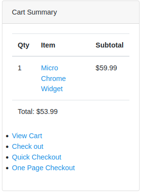  

## Checkout Barang
Klik pilihan *View Cart* pada bagian *__Cart Summary__*.  
Pilih item yang akan di-*checkout* lalu klik tombol *__Checkout__*  
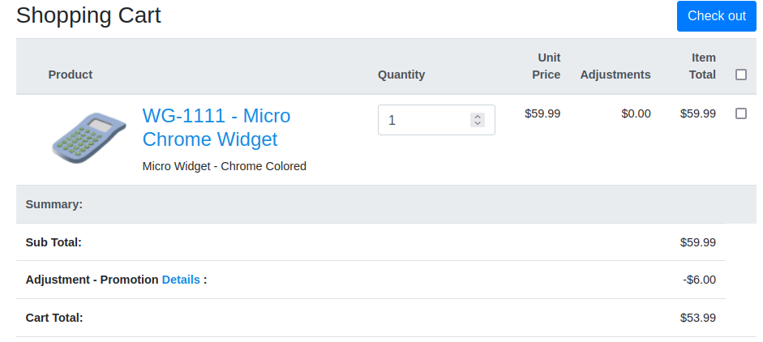  
  
Pilih alamat yang akan digunakan sebagai tujuan pengiriman. Kemudian klik *__Next__*.  
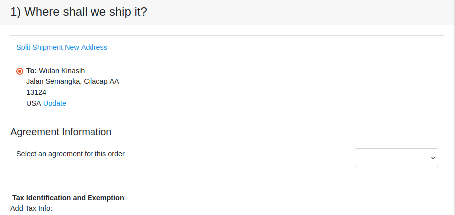  

Pilih ekspedisi pengiriman yang anda inginkan
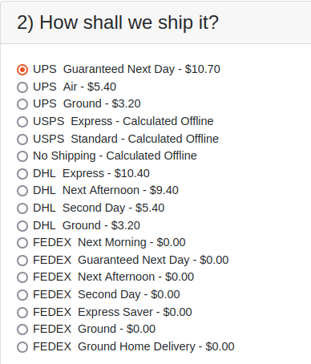
  
Tambahkan pesan atau instruksi tambahan apabila perlu.  
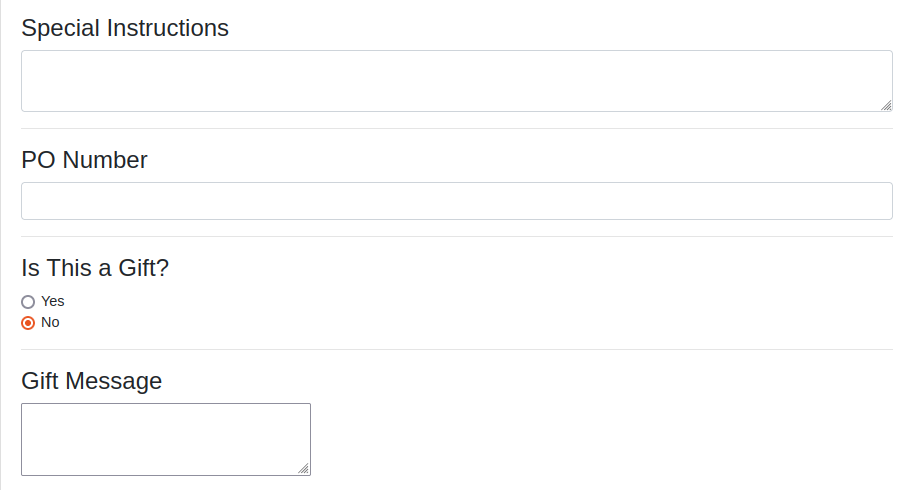  
Kemudian klik *__Next__*.  
  
Selanjutnya pilih metode pembayaran yang akan anda gunakan. Kemudian klik tombol *__Continue to Final Order Review__*.  
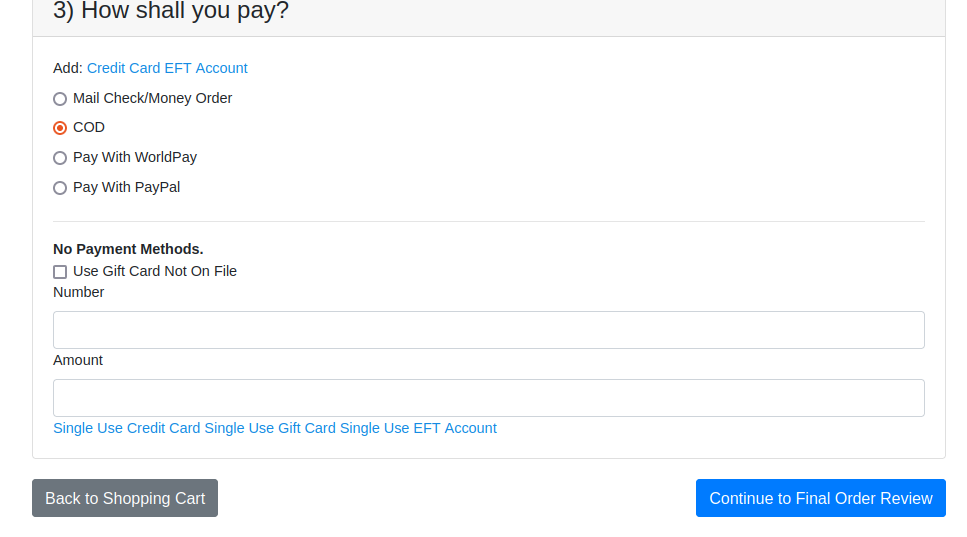  
  
Review kembali barang yang ingin Anda checkout, apabila sudah yakin silakan klik tombol *__Submit Order__*.  
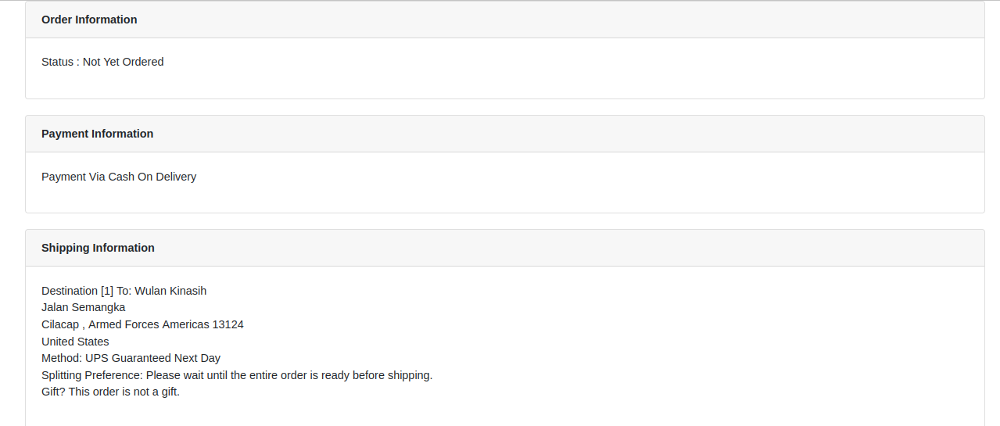
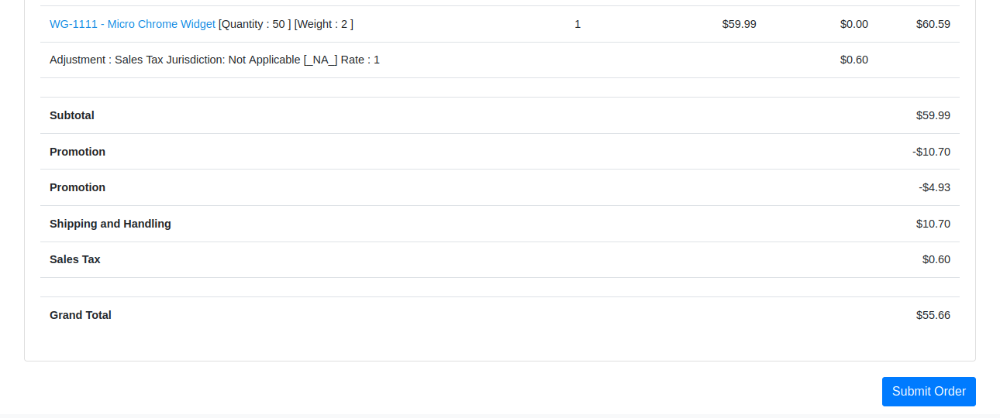    
  
Proses checkout telah selesai dan Anda akan mendapatkan informasi *Order Confirmation*.  
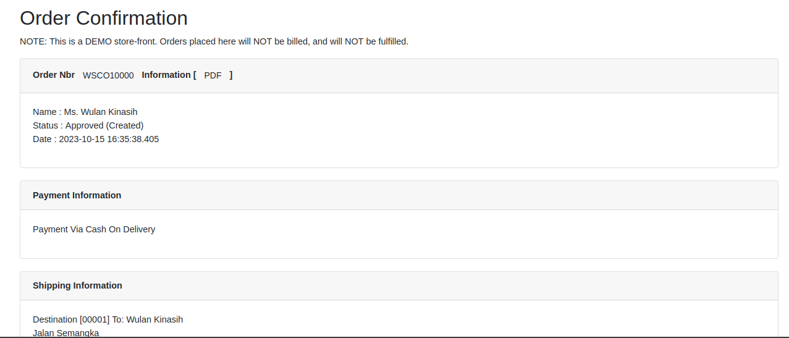   
  
Selesai.