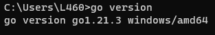

### Contoh Program Go untuk Koneksi dan Membaca Data dari MySQL dan MongoDB
Pastikan anda sudah menginstall Go dan mysql server, anda bisa cek Go version dengan perintah berikut:


Untuk menjalankan file `go-mysql.go`, perhatikan kode di bawah ini:
```
db, err := sql.Open("mysql", "user:password@tcp(localhost:3306)/db_mahasiswa")
```
Ubah user dan password sesuai yang anda gunakan.

Jalankan file dengan perintah:  
```
go get .
go run go-mysql.go
```
Untuk menjalankan file `go-mongodb.go`, gunakan perintah berikut:
```
go get .
go run go-mongodb.go
```


Untuk menjalankan file `restful-api.go`, gunakan perintah berikut:
```
go get .
go run restful-api.go
```
lalu akses `http://localhost:8080/mysql-data` dan `http://localhost:8080/mongodb-data`