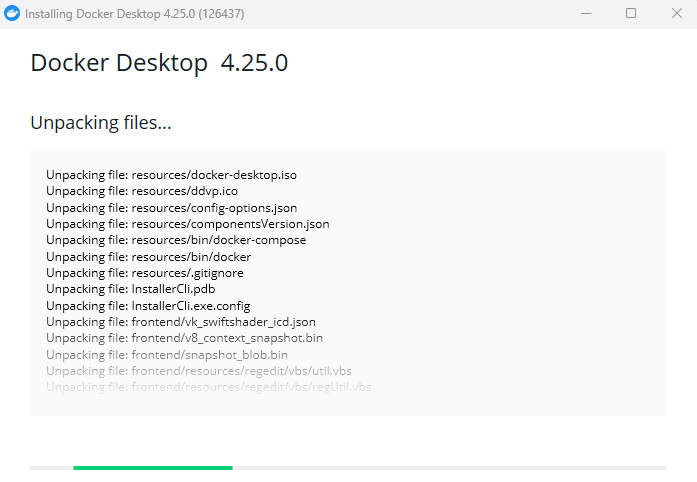

# Latihan Minggu 7
## Instalasi Docker
Jalankan file instaler Docker yang sudah diunduh. Centang opsi *Use WSL 2 instead of Hyper-V* dan *Add shortcut to desktop*.
  
  
Tunggu hingga proses *unpacking files* selesai.   
  
  
Instalasi telah selesai. Restart untuk menyelesaikan instalasi

  
  
Jalankan Docker Desktop kemudian lanjutkan dengan *Sign in* apabila sudah memiliki akun docker atau pilih *Continue without signing in* jika belum.
  
  
## 2. Get Started - Docker
### 2.1 Containerize an application
Cloning repositori *getting-started-app*.  
```
git clone https://github.com/docker/getting-started-app.git 
```


Masuk ke dalam direktori `getting-started-app` kemudian buat file `Dockerfile`.  
```
cd getting-started-app
```


Buatlah file Dockerfile di dalamnya, lalu tambahkan content berikut:
```
# syntax=docker/dockerfile:1

FROM node:18-alpine
WORKDIR /app
COPY . .
RUN yarn install --production
CMD ["node", "src/index.js"]
EXPOSE 3000
```
Build image dengan perintah:
```
docker build -t getting-started .
```
  

Jalankan container dengan perintah:  
```
docker run -dp 127.0.0.1:3000:3000 getting-started
```
Buka browser kemudian akses ke halaman 127.0.0.1:3000.  
  
  
Cek dengan perintah `docker ps` untuk melihat daftar container yang berjalan.  
  
  
### 2.2 Update the application
Lakukan modifikasi pada file `src/static/js/app.js`.  
```
- <p className="text-center">No items yet! Add one above</p>
+ <p className="text-center">You have no todo items yet! Add one above!</p>
```
  
Hentikan container yang sedang berjalan.  
```
$ docker stop <ID container atau nama container>
```
Kemudian build ulang image dengan perintah:  
```
$ docker build -t getting-started .
```


Jalankan container dengan perintah:  
```
$ docker run -dp 127.0.0.1:3000:3000 getting-started
```
Refresh halaman `127.0.0.1:3000`.  
  
  
### 2.3 Share the application
Login ke [Docker Hub](https://hub.docker.com/), kemudian buatlah repositori baru.
  
Pada bagian *Repository Name* diisi dengan `getting-started` dan pastikan *Visibility* nya `Public`.  
  
  
Login ke docker hub melalui terminal dengan perintah berikut:  
```
$ docker login -u NAMA_USERNAME_ANDA
```
  
  
Buat *tag* untuk image `getting-started` dengan perintah berikut:  
```
$ docker tag getting-started NAMA_USERNAME_ANDA/getting-started
```

  
  
Push image yang sudah diberi tag tadi ke docker hub dengan perintah:  
```
$ docker push NAMA_USERNAME_ANDA/getting-started
```
  

Akses situs [Play with Docker](https://labs.play-with-docker.com/), kemudian login dengan akun docker yang digunakan.  
  
Klik tombol *__ADD NEW INSTANCE__*, kemudian jalankan container dari image yang sudah di-*push* ke docker hub tadi.  
```
$ docker run -dp 0.0.0.0:3000:3000 NAMA_USERNAME_ANDA/getting-started
```
  
  
Klik nomor port *__3000__* untuk mengakses halaman web.  
  
  
### 2.4 Persist the DB
Buat sebuah *volume* dengan perintah:  
```
$ docker volume create NAMA_VOLUME
```

  
  
Hapus container sebelumnya dengan perintah `docker rm -f <id>`  

Jalankan kembali container dari image `getting-started` dengan menambahkan parameter `--mount`:  
```
$ docker run -dp 127.0.0.1:3000:3000 --mount type=volume,src=todo-db,target=/etc/todos getting-started
```
  
  
Akses Todo App melalui browser kemudian tambahkan beberapa data.  
  
  
Hentikan dan hapus container yang sedang berjalan.  
  
  
Jalankan container baru dengan menambahkan parameter `--mount` seperti pada langkah-langkah sebelumnya.  
  
Cek browser kembali dan pastikan data yang sebelumnya sudah pernah diinputkan masih ada.  
  
  
Untuk mengetahui lokasi dimana volume berada, gunakan perintah:  
```
$ docker volume inspect NAMA_VOLUME
```
  
  
### 2.5 Use bind mounts
Jalankan container baru dengan perintah:  
```
docker run -it --mount "type=bind,src=$pwd,target=/src" ubuntu bash
```
Perintah di atas akan melakukan *mount* direktori `src` yang ada di dalam container ke direktori yang saat ini sedang aktif pada host.  
  

Setelah menjalankan perintah, Docker memulai sesi bash interaktif di direktori root sistem file container


Dari dalam container, masuk ke direktori `src` kemudian cek isi direktorinya. Setelah itu buat sebuah file baru dengan nama `myfile.txt`.  
![membuat file baru di dalam direktori src]

    
  
Keluar dari container dengan perintah `exit`.
  
### 2.6 Multi-container apps
Buatlah sebuah network dengan perintah berikut:  
```
docker network create NAMA_NETWORK
```
  
  
Jalankan sebuah container MySQL dan hubungkan container tersebut ke dalam network yang telah dibuat tadi. Berikut perintah lengkapnya:  
```
$ docker run -d \
    --network todo-app --network-alias mysql \
    -v todo-mysql-data:/var/lib/mysql \
    -e MYSQL_ROOT_PASSWORD=secret \
    -e MYSQL_DATABASE=todos \
    mysql:8.0
```
  
  
Akses container MySQL menggunakan perintah 
```
docker exec -it <ID Container> mysql -u root -p
``` 
dan gunakan password `secure` untuk login. Kemudian cek isi database menggunakan perintah 
```
SHOW DATABASES;
```  
  
  
Selanjutnya jalankan container untuk todo app dan ketikkan perintah berikut:  
```
$ docker run -dp 127.0.0.1:3000:3000 \
  -w /app -v "$(pwd):/app" \
  --network todo-app \
  -e MYSQL_HOST=mysql \
  -e MYSQL_USER=root \
  -e MYSQL_PASSWORD=secret \
  -e MYSQL_DB=todos \
  node:18-alpine \
  sh -c "yarn install && yarn run dev"
```

  