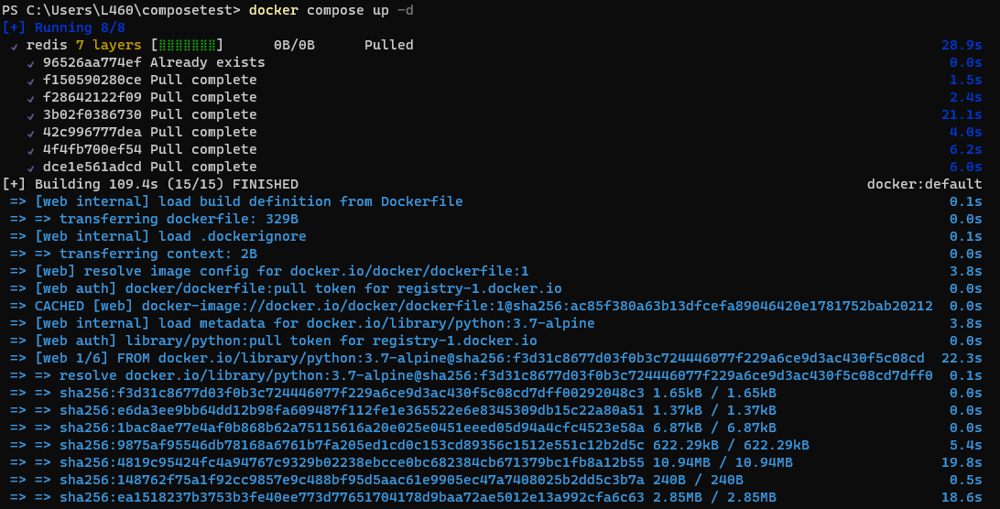

# Latihan Minggu 08
## Step 1: Define the application dependencies
Buatlah sebuah direktori bernama `composetest`
```
mkdir composetest
cd composetest
```

Lalu buatlah sebuah file `app.py` pada direktori tersebut dan salin code berikut:
```
import time

import redis
from flask import Flask

app = Flask(__name__)
cache = redis.Redis(host='redis', port=6379)

def get_hit_count():
    retries = 5
    while True:
        try:
            return cache.incr('hits')
        except redis.exceptions.ConnectionError as exc:
            if retries == 0:
                raise exc
            retries -= 1
            time.sleep(0.5)

@app.route('/')
def hello():
    count = get_hit_count()
    return 'Hello World! I have been seen {} times.\n'.format(count)
```


Masih di dalam direktori *composetest*, buatlah file baru bernama requirements.txt dan salinlah code berikut:
```
flask
redis
```


## Step 2: Create a Dockerfile
Setelah itu, buatlah sebuah file Dockerfile dan salin code berikut:
```
# syntax=docker/dockerfile:1
FROM python:3.7-alpine
WORKDIR /code
ENV FLASK_APP=app.py
ENV FLASK_RUN_HOST=0.0.0.0
RUN apk add --no-cache gcc musl-dev linux-headers
COPY requirements.txt requirements.txt
RUN pip install -r requirements.txt
EXPOSE 5000
COPY . .
CMD ["flask", "run"]
```


## Step 3: Define services in a Compose file
Buatlah file compose.yaml dan salin code berikut:
```
services:
  web:
    build: .
    ports:
      - "8000:5000"
  redis:
    image: "redis:alpine"
```


## Step 4: Build and run your app with Compose
Jalankan `docker compose up`


Akses  http://localhost:8000/ pada browser anda untuk. Anda akan melihat pesan berikut:


## Step 5: Edit the Compose file to add a bind mount
Edit file `compose.yaml` untuk menambahkan bind mount
```
services:
  web:
    build: .
    ports:
      - "8000:5000"
    volumes:
      - .:/code
    environment:
      FLASK_DEBUG: "true"
  redis:
    image: "redis:alpine"
```


## Step 6: Re-build and run the app with Compose
Jalankan `docker compose up`


## Step 8: Experiment with some other commands
Jika anda menjalankan compose dengan `docker compose up -d`, hentikan dengan perintah berikut:
```
docker compose stop
```
dan menghapus container dengan command `down`, sertakan `--volumes` untuk menghapus volume data yang digunakan
```
docker compose down --volumes
```
