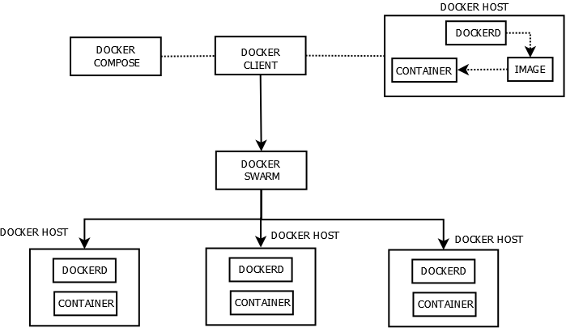

# Tugas Minggu 08
Buatlah satu diagram yang bisa menggambarkan keterkaitan antara semua point-point di bawah ini:

- Docker image
- Container
- dockerd
- docker client
- docker compose
- docker swarm
__Jawab__:

__Penjelasan__:
- __Docker Image__: Ini adalah paket yang berisi segala sesuatu yang diperlukan untuk menjalankan sebuah aplikasi, termasuk kode, runtime, pustaka, dan dependensinya. Docker image dapat dianggap sebagai template dari suatu lingkungan aplikasi.
- __Container__: Ini adalah instance yang berjalan dari Docker image. Container menyediakan lingkungan yang terisolasi untuk menjalankan aplikasi tanpa mengganggu sistem host. Container dapat dihentikan, dimulai, dihapus, dan dikelola dengan mudah.
- __dockerd (Docker Daemon)__: Ini adalah proses latar belakang yang menjalankan dan mengelola container pada host sistem. Docker daemon berkomunikasi dengan Docker API dan menerima perintah dari Docker client. Ia juga bertanggung jawab atas pembuatan, menjalankan, dan mengelola container.
- __Docker Client__: Ini adalah antarmuka yang memungkinkan pengguna berinteraksi dengan Docker daemon. Pengguna dapat memberikan perintah kepada Docker daemon melalui Docker client untuk membuat, menjalankan, dan mengelola container.
- __Docker Compose__: Sebuah alat untuk mendefinisikan dan menjalankan aplikasi Docker yang terdiri dari beberapa container. Docker Compose menggunakan file konfigurasi YAML untuk mendefinisikan layanan, jaringan, dan volume yang diperlukan untuk aplikasi.
- __Docker Swarm__: Ini adalah alat orkestrasi Docker yang memungkinkan manajemen dan penjadwalan container pada beberapa host Docker. Docker Swarm memungkinkan pembentukan cluster dari host Docker dan mendistribusikan kontainer di antara host-host ini untuk meningkatkan ketersediaan dan skalabilitas aplikasi.

Secara singkat, Docker image digunakan untuk membuat container, Docker daemon (dockerd) menjalankan dan mengelola container, Docker client digunakan untuk berinteraksi dengan Docker daemon, Docker Compose untuk mengelola aplikasi multi-container, dan Docker Swarm untuk orkestrasi dan manajemen kontainer di lingkungan skala besar.

