# Praktikum Minggu-09
## Docker for Beginners - Linux
### Task 0: Prerequisites
Clone repositori berikut:
```
git clone https://github.com/dockersamples/linux_tweet_app
```
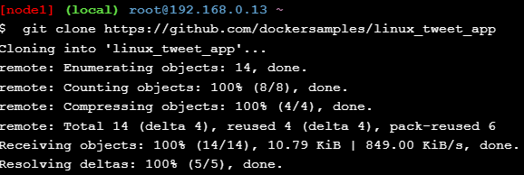
### Task 1: Run some simple Docker containers
#### Run a single task in an Alpine Linux container
Jalankan perintah di bawah ini:
```
docker container run alpine hostname
```
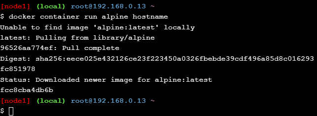
Anda dapat melihat list semua container dengan perintah berikut:
```
docker container ls --all
```
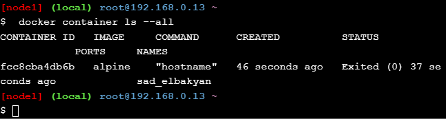
#### Run an interactive Ubuntu container
Untuk menjalankan container secara interaktif, jalankan perintah berikut ini:
```
docker container run --interactive --tty --rm ubuntu bash
``` 
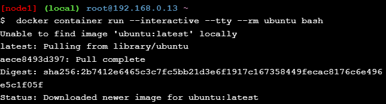
Di dalam shell, kita dapat mengeksekusi perintah-perintah seperti ls, ps, dan cat
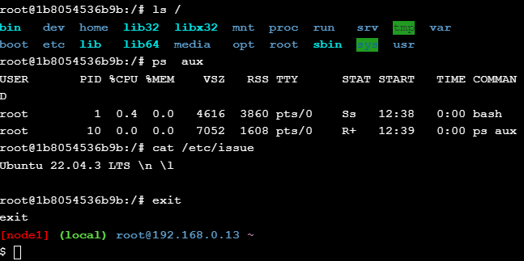
Eksekusi perintah `exit` untuk keluar dari shell.
#### Run a background MySQL container
Jalankan perintah di bawah ini:
```
docker container run \
 --detach \
 --name mydb \
 -e MYSQL_ROOT_PASSWORD=my-secret-pw \
 mysql:latest
```
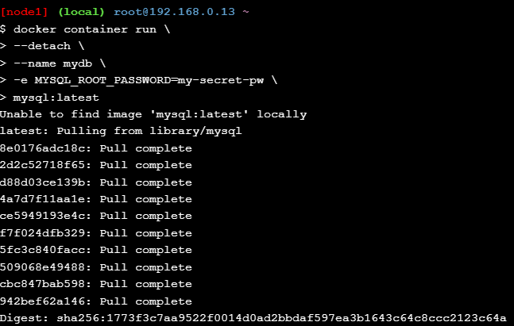
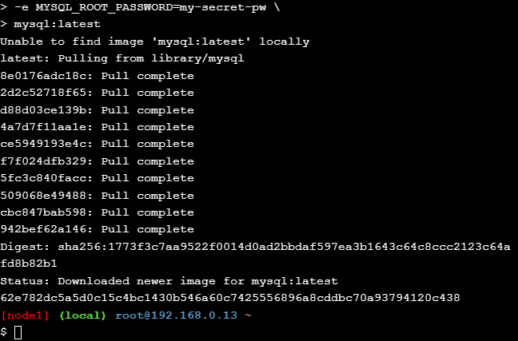
Anda dapat mengecek container yang sedang berjalan dengan perintah berikut:
```
docker container ls
```
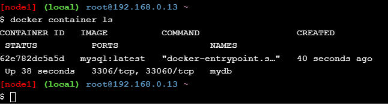
Untuk menjalankan perintah di dalam container yang sedang berjalan, gunakan perintah berikut:
```
docker exec -it mydb \
 mysql --user=root --password=$MYSQL_ROOT_PASSWORD --version
```
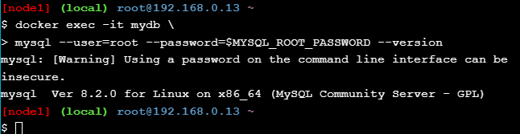
### Task 2: Package and run a custom app using Docker
Masuk ke dalam direktori `linux_tweet_app`
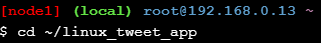
Cek isi file Dockerfile dengan perintah:
```
cat Dockerfile
```
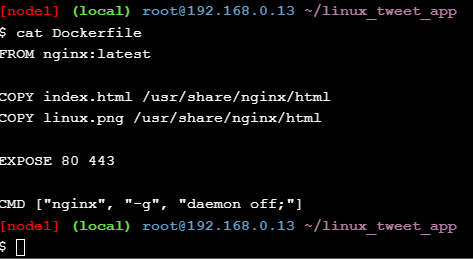
Export DOCKERID:
```
export DOCKERID=<NAMA DOCKER ID ANDA>
```
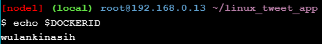
Gunakan perintah `docker image build` untuk membuat image Docker baru menggunakan instruksi di Dockerfile. `--tag` untuk memberikan nama khusus pada image.
```
docker image build --tag $DOCKERID/linux_tweet_app:1.0 .
```
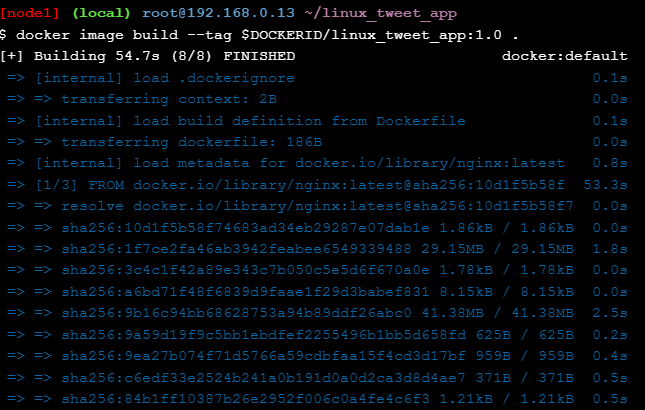
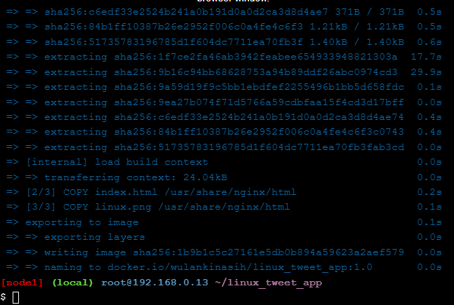
Buat container baru menggunakan image yang sudah dibuat sebelumnya.
```
docker container run \
 --detach \
 --publish 80:80 \
 --name linux_tweet_app \
 $DOCKERID/linux_tweet_app:1.0
```
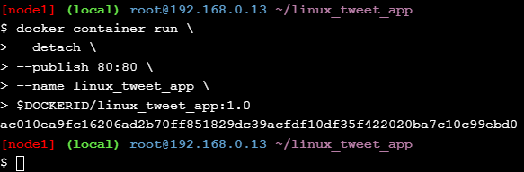
Berikut adalah tampilan yang dihasilkan:

Hapus container dengan perintah berikut:
```
docker container rm --force linux_tweet_app
```
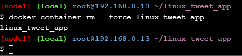
### Task 3: Modify a running website
Jalankan perintah berikut:
```
docker container run \
 --detach \
 --publish 80:80 \
 --name linux_tweet_app \
 --mount type=bind,source="$(pwd)",target=/usr/share/nginx/html \
 $DOCKERID/linux_tweet_app:1.0
```
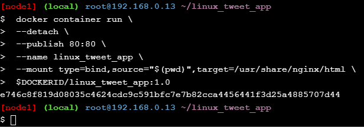
Ganti `index.html` dengan `index-new.html`
```
cp index-new.html index.html
```
Berikut perubahan tampilan yang dihasilkan:

Hapus container dengan perintah berikut ini:
```
docker rm --force linux_tweet_app
```
Jalankan container baru dengan perintah yang sama
```
docker container run \
 --detach \
 --publish 80:80 \
 --name linux_tweet_app \
 $DOCKERID/linux_tweet_app:1.0
```
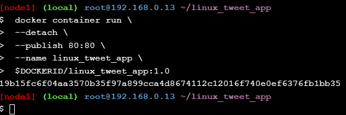
Tampilan halaman akan sama seperti sebelum dimodifikasi

Hapus kembali container dengan perintah berikut:
```
docker rm --force linux_tweet_app
```
Lakukan update image dengan perintah berikut:
```
docker image build --tag $DOCKERID/linux_tweet_app:2.0 .
```
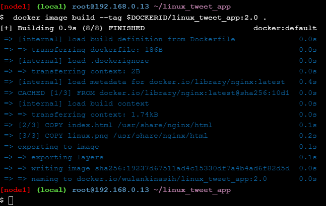
Cek dengan perintah `ls`
```
docker image ls
```
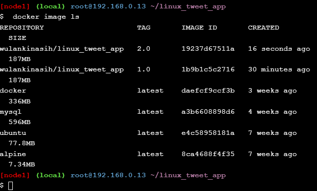
Jalankan container menggunakan image yang telah diupdate:
```
docker container run \
 --detach \
 --publish 80:80 \
 --name linux_tweet_app \
 $DOCKERID/linux_tweet_app:2.0
```
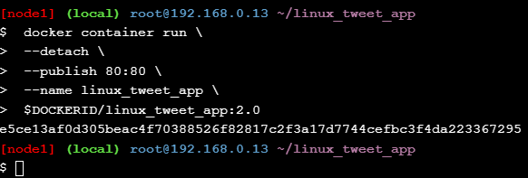

Jalankan juga container menggunakan image yang belum diupdate:
```
docker container run \
 --detach \
 --publish 8080:80 \
 --name old_linux_tweet_app \
 $DOCKERID/linux_tweet_app:1.0
```
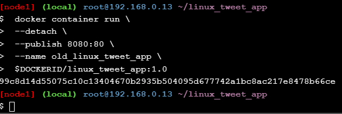

Push image ke DockerHub. Login dengan menggunakan perintah `docker login`
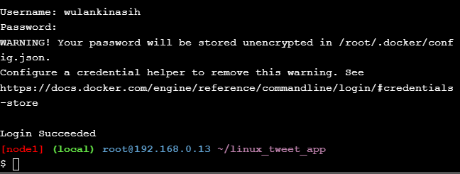
Push image versi pertama:
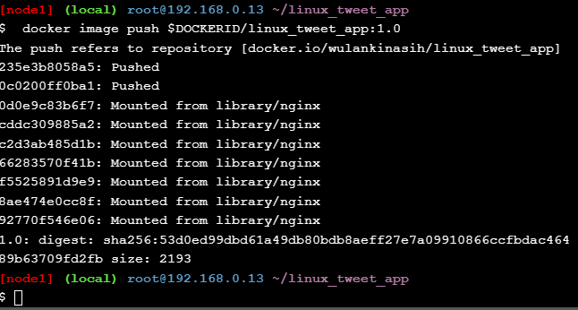
```
docker image push $DOCKERID/linux_tweet_app:1.0
```
Push image versi kedua:
```
docker image push $DOCKERID/linux_tweet_app:2.0
```
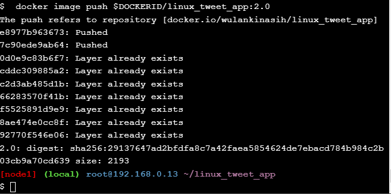
Cek pada repo DockerHub anda:
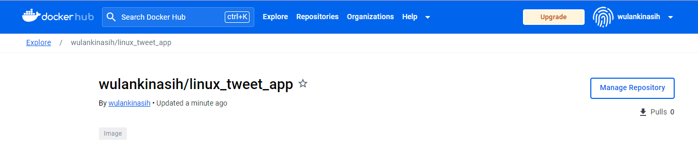
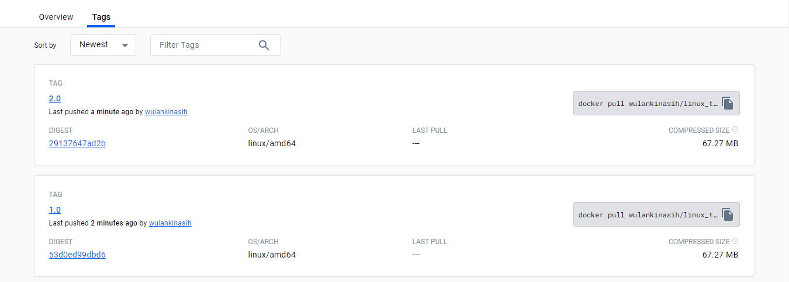