# Docker Networking
## Section #1 - Networking Basics
### Step 1: The Docker Network Command
Perintah `docker network` adalah perintah utama untuk mengonfigurasi dan mengelola jaringan kontainer. Jalankan perintah `docker network` dari terminal pertama.
```
docker network
```
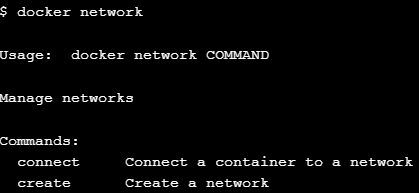

### Step 2: List networks
Untuk melihat daftar yang ada pada Docker Host, jalankan perintah `docker network ls`.
```
docker network ls
```
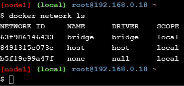

### Step 3: Inspect a network
Untuk melihat konfigurasi network dengan nama bridge, jalankan perintah berikut:
```
docker network inspect bridge
```
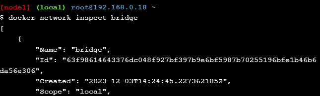

### Step 4: List network driver plugins
Jalankan perintah `docker info` untuk melihat informasi tentang Installasi Docker.
```
docker info
```
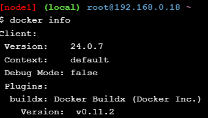

## Section #2 - Bridge Networking
### Step 1: The Basics
Kita dapat melihat daftar network yang ada pada Docker dengan perintah `docker network ls`.
Install command `brctl`.
```
apk update
apk add bridge
```
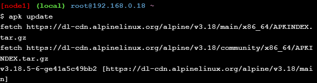
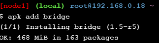

List bridge pada Docker Host dengan menjalankan perintah berikut:
```
brctl-show
```
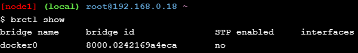

### Step 2: Connect a container
Jalankan container baru dengan perintah berikut:
```
docker run -dt ubuntu sleep infinity
```
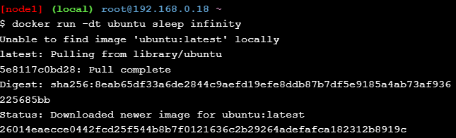

Jalankan kembali perintah `brctl show`.
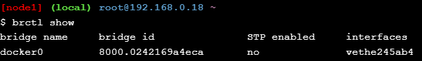

Jalankan perintah `docker network inspect bridge` untuk melihat konfigurasi network.
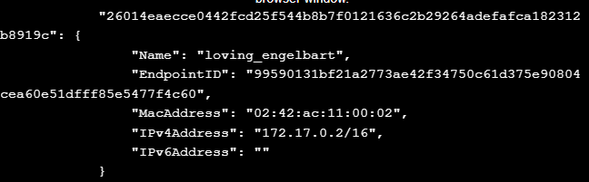

### Step 3: Test network connectivity
Lakukan ping dari Docker host ke container.
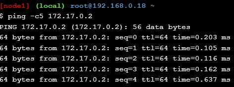

Untuk melihat ID container, jalankan perintah berikut:
```
docker ps
```
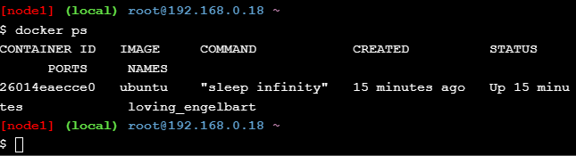

Jalankan perintah `docker exec -it <CONTAINER ID> /bin/bash`
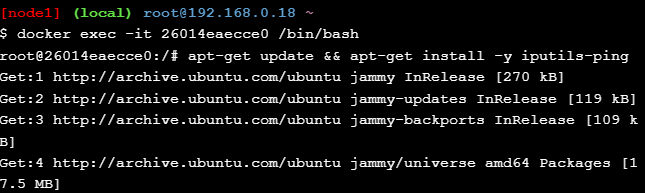

Install ping program:
```
apt-get update && apt-get install -y iputils-ping
```
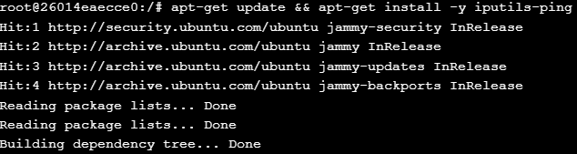

Lakukan ping www.github.com dengan running `ping -c5 www.github.com`
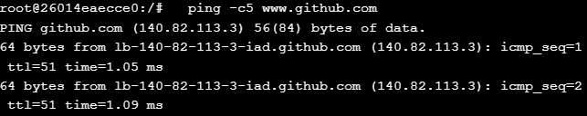

### Step 4: Configure NAT for external connectivity
Jalankan container baru dengan image NGINX
```
docker run --name web1 -d -p 8080:80 nginx
```
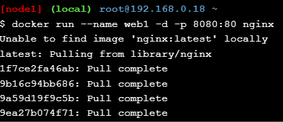
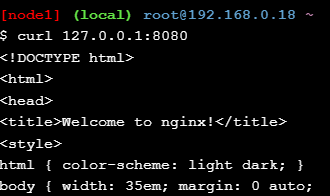

## Section #3 - Overlay Networking
### Step 1: The Basics
Inisialisasi swarm, join a single worker node, dan verify the operations worked dengan perintah berikut:
```
docker swarm init --advertise-addr $(hostname -i)
```
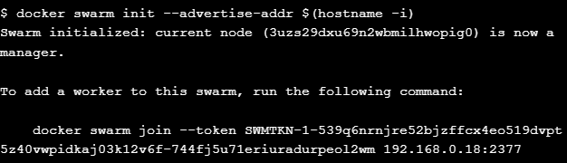

Lakukan join pada node ke-2:
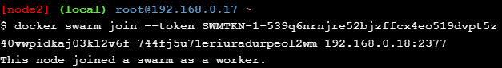
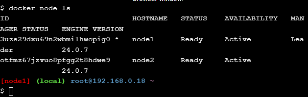

### Step 2: Create an overlay network
Jalankan perintah berikut pada node ke-1:
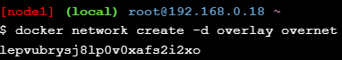
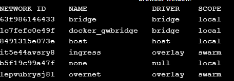

### Step 3: Create a service
Jalankan perintah berikut pada terminal pertama untuk membuat service baru
```
docker service create --name myservice \
--network overnet \
--replicas 2 \
ubuntu sleep infinity
```
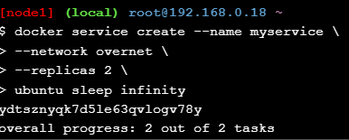

Cek konfigurasi network
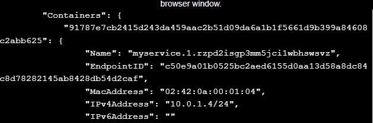

### Step 4: Test the network
Install ping command dengan perintah berikut:
```
apt-get update && apt-get install -y iputils-ping
```
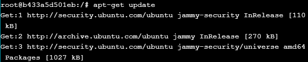
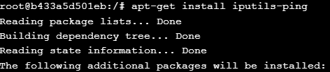

Kemudian lakukan ping
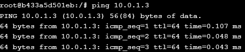

### Step 5: Test service discovery
Masih di dalam kontainer sebelumnya, jalankan perintah berikut:
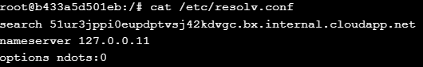

Lakukan ping
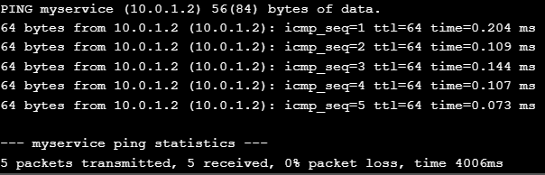

Inspect konfigurasi myservice:
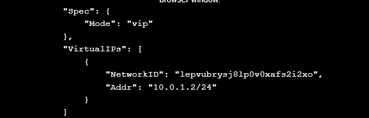

## Cleaning Up
Jalankan perintah `docker service rm myservice` untuk menghapus service *myservice*
```
docker service rm myservice
```
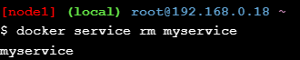

Menghapus node 1 dan node 2 dari Swarm. Jalankan pada node 1 dan node 2 perintah berikut ini:
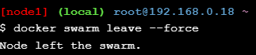
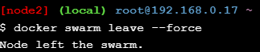