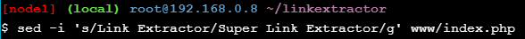

# Praktikum Teknologi Cloud Minggu 11
## Application Containerization and Microservice Orchestration
### Stage Setup
Cloning repository
```
git clone https://github.com/ibnesayeed/linkextractor.git
cd linkextractor
git checkout demo
```

### Step 0: Basic Link Extractor Script
Checkout the step0 branch and list files in it.
```
git checkout step0
tree
```


The linkextractor.py file is the interesting one here, so let’s look at its contents:
```
cat linkextractor.py
```

```
./linkextractor.py http://example.com/
```

```
ls -l linkextractor.py
```

```
python3 linkextractor.py
```

### Step 1: Containerized Link Extractor Script
Checkout the step1 branch and list files in it.
```
git checkout step1
tree
```


We have added one new file (i.e., Dockerfile) in this step. Let’s look into its contents:
```
cat Dockerfile
```


We have just described how we want our Docker image to be like, but didn’t really build one. So let’s do just that:
```
docker image build -t linkextractor:step1 .
```

```
docker image ls
```

```
docker container run -it --rm linkextractor:step1 http://example.com/
```


Let’s try it on a web page with more links in it:
```
docker container run -it --rm linkextractor:step1 https://training.play-with-docker.com/
```


### Step 2: Link Extractor Module with Full URI and Anchor Text
Checkout the step2 branch and list files in it.
```
git checkout step2
tree
```

```
cat linkextractor.py
```

```
docker image build -t linkextractor:step2 .
```

```
docker image ls
```

```
docker container run -it --rm linkextractor:step2 https://training.play-with-docker.com/
```

```
docker container run -it --rm linkextractor:step1 https://training.play-with-docker.com/
```

### Step 3: Link Extractor API Service
Checkout the step3 branch and list files in it.
```
git checkout step3
tree
```


Let’s first look at the Dockerfile for changes:
```
cat Dockerfile
```

```
cat main.py
```


Build a new image with these changes in place:
```
docker image build -t linkextractor:step3 .
```


Then run the container in detached mode (-d flag) so that the terminal is available for other commands while the container is still running. Note that we are mapping the port 5000 of the container with the 5000 of the host (using -p 5000:5000 argument) to make it accessible from the host. We are also assigning a name (--name=linkextractor) to the container to make it easier to see logs and kill or remove the container.
```
docker container run -d -p 5000:5000 --name=linkextractor linkextractor:step3
```


If things go well, we should be able to see the container being listed in Up condition:
```
docker container ls
```


We can now make an HTTP request in the form /api/<url> to talk to this server and fetch the response containing extracted links:
```
curl -i http://localhost:5000/api/http://example.com/
```


Now, we have the API service running that accepts requests in the form /api/<url> and responds with a JSON containing hyperlinks and anchor texts of all the links present in the web page at give <url>.

Since the container is running in detached mode, so we can’t see what’s happening inside, but we can see logs using the name linkextractor we assigned to our container:
```
docker container logs linkextractor
```


We can see the messages logged when the server came up, and an entry of the request log when we ran the curl command. Now we can kill and remove this container
```
docker container rm -f linkextractor
```

### Step 4: Link Extractor API and Web Front End Services
Checkout the step4 branch and list files in it.
```
git checkout step4
tree
```


Look at the docker-compose.yml file we have:
```
cat docker-compose.yml
```


Look at the user-facing www/index.php file:
```
cat www/index.php
```


Let’s bring these services up in detached mode using docker-compose utility:
```
docker-compose up -d --build
```


Checking for the list of running containers confirms that the two services are indeed running:
```
docker container ls
```


We should now be able to talk to the API service as before:
```
curl -i http://localhost:5000/api/http://example.com/
```


Modify the www/index.php file to replace all occurrences of Link Extractor with Super Link Extractor:
```
sed -i 's/Link Extractor/Super Link Extractor/g' www/index.php
```

```
git reset --hard
```


Before we move on to the next step we need to shut these services down, but Docker Compose can help us take care of it very easily:
```
docker-compose down
```

### Step 5: Redis Service for Caching
Checkout the step5 branch and list files in it.
```
git checkout step5
tree
```


Inspect the newly added Dockerfile under the ./www folder:
```
cat www/Dockerfile
```


Look at the API server’s api/main.py file where we are utilizing the Redis cache:
```
cat api/main.py
```


Look into the updated docker-compose.yml file:
```
cat docker-compose.yml
```


Boot these services up:
```
docker-compose up -d --build
```


To check whether or not the Redis service is being utilized, we can use docker-compose exec followed by the redis service name and the Redis CLI’s monitor command:
```
docker-compose exec redis redis-cli monitor
```


Now, try to extract links from some web pages using the web interface and see the difference in Redis log entries for pages that are scraped the first time and those that are repeated. Before continuing further with the tutorial, stop the interactive monitor stream as a result of the above redis-cli command by pressing Ctrl + C keys while the interactive terminal is in focus.

Now that we are not mounting the /www folder inside the container, local changes should not reflect in the running service:
```
sed -i 's/Link Extractor/Super Link Extractor/g' www/index.php
```


Verify that the changes made locally do not reflect in the running service by reloading the web interface and then revert changes:
```
git reset --hard
```


Now, shut these services down and get ready for the next step:
```
docker-compose down
```

### Step 6: Swap Python API Service with Ruby
Checkout the step6 branch and list files in it.
```
git checkout step6
tree
```


Let’s have a quick walk through the changed files:
```
cat api/linkextractor.rb
```

```
cat api/Dockerfile
```


Above Dockerfile is written for the Ruby script and it is pretty much self-explanatory.
```
cat docker-compose.yml
```


The docker-compose.yml file has a few minor changes in it. The api service image is now named linkextractor-api:step6-ruby, the port mapping is changed from 5000 to 4567 (which is the default port for Sinatra server), and the API_ENDPOINT environment variable in the web service is updated accordingly so that the PHP code can talk to it.

With these in place, let’s boot our service stack:
```
docker-compose up -d --build
```


We should now be able to access the API (using the updated port number):
```
curl -i http://localhost:4567/api/http://example.com/
```


We can use the tail command with the -f or --follow option to follow the log output live.
```
tail -f logs/extraction.log
```


To stop following the log, press Ctrl + C keys while the interactive terminal is in focus.

We can shut the stack down now:
```
docker-compose down
```
Since we have persisted logs, they should still be available after the services are gone:
```
cat logs/extraction.log
```


