# Docker Orchestration Hands-on Lab
## Configure Swarm Mode
```
docker run -dt ubuntu sleep infinity
```
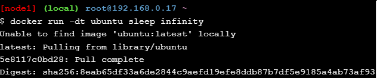

Cek dengan perintah `docker ps`
```
docker ps
```
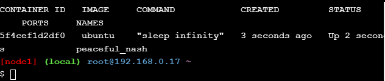
### Create a Manager node
Pada node1, lakukan inisialisasi swarm
```
docker swarm init --advertise-addr $(hostname -i)
```
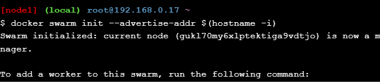

Cek dengan perintah `docker info`
```
docker info
```
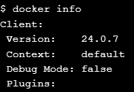
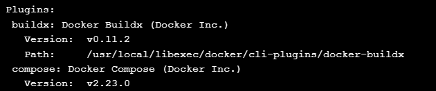
### Join Worker nodes to the Swarm
Tambahkan node2 dan node3 ke dalam swarm dengan menggunakan perintah `docker swarm join`
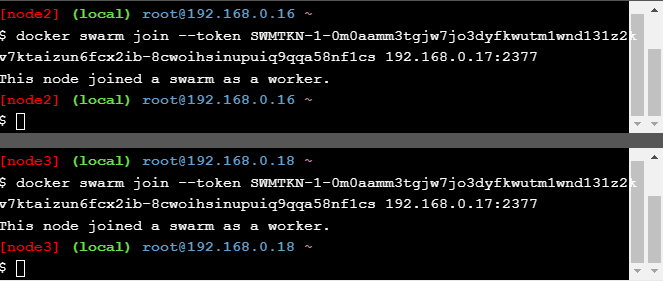

Cek dengan perintah `docker node ls`
```
docker node ls
```
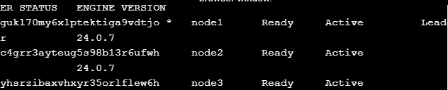
## Deploy applications across multiple hosts
### Deploy the application components as Docker services
Buat service sleep-app pada node1
```
docker service create --name sleep-app ubuntu sleep infinity
```
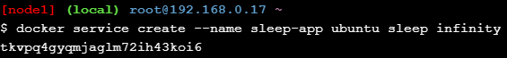

Cek dengan perintah `docker service ls`
```
docker service ls
```
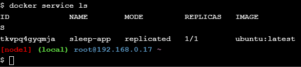
## Scale the application
```
docker service update --replicas 7 sleep-app
```
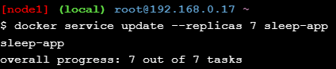
```
docker service ps sleep-app
```
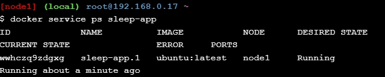
## Drain a node and reschedule the containers
```
docker node ls
```
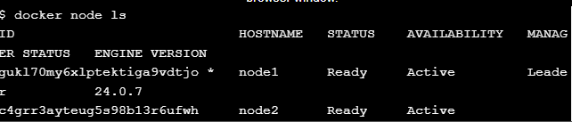
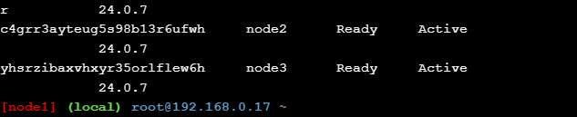
```
docker node update --availability drain <node ID>
```
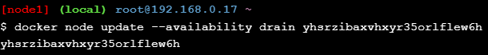
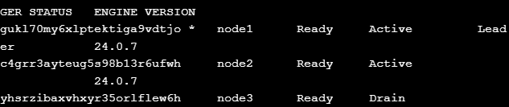

Jalankan perintah `docker service ps sleep-app`.
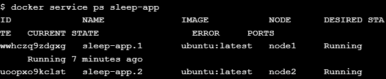
## Cleaning Up
```
docker service rm sleep-app
```
Hapus node1, node2, dan node3 dari swarm.
```
docker swarm leave --force
```
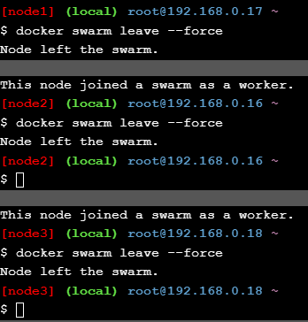
