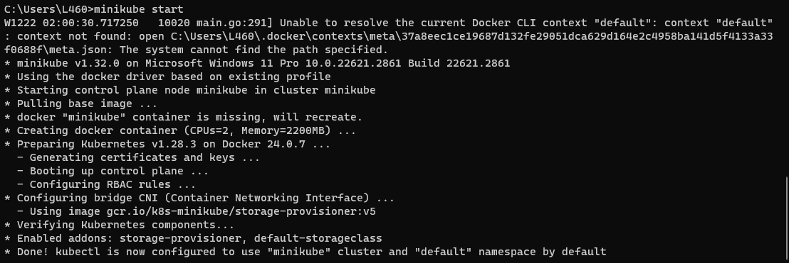
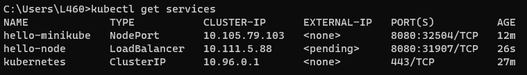

# Praktikum Teknologi Cloud Minggu ke-13
## Memulai -  Menggunakan Minikube
### Create a minikube cluster
```
minikube start
```

### Open the Dashboard
Open a new terminal, and run:
```
minikube dashboard
```


### Create a Deployment
A Kubernetes Pod is a group of one or more Containers, tied together for the purposes of administration and networking. The Pod in this tutorial has only one Container. A Kubernetes Deployment checks on the health of your Pod and restarts the Pod's Container if it terminates. Deployments are the recommended way to manage the creation and scaling of Pods.

1. Use the kubectl create command to create a Deployment that manages a Pod. The Pod runs a Container based on the provided Docker image.
```
kubectl create deployment hello-node --image=registry.k8s.io/e2e-test-images/agnhost:2.39 -- /agnhost netexec --http-port=8080
```


2. View the Deployment:
```
kubectl get deployments
```


3. View the Pod:
```
kubectl get pods
```


4. View cluster events:
```
kubectl get events
```


5. View the `kubectl` configuration:
```
kubectl config view
```


6. View application logs for a container in a pod.
```
kubectl logs hello-node-5f76cf6ccf-br9b5
```

### Create a Service
By default, the Pod is only accessible by its internal IP address within the Kubernetes cluster. To make the hello-node Container accessible from outside the Kubernetes virtual network, you have to expose the Pod as a Kubernetes Service.

1. Expose the Pod to the public internet using the kubectl expose command:
```
kubectl expose deployment hello-node --type=LoadBalancer --port=8080
```


The --type=LoadBalancer flag indicates that you want to expose your Service outside of the cluster.

The application code inside the test image only listens on TCP port 8080. If you used kubectl expose to expose a different port, clients could not connect to that other port.

2. View the Service you created:
```
kubectl get services
```


On cloud providers that support load balancers, an external IP address would be provisioned to access the Service. On minikube, the `LoadBalancer` type makes the Service accessible through the `minikube service` command.

3. Run the following command:
```
minikube service hello-node
```


This opens up a browser window that serves your app and shows the app's response.
### Enable addons
The minikube tool includes a set of built-in addons that can be enabled, disabled and opened in the local Kubernetes environment.

1. List the currently supported addons:
```
minikube addons list
```


2. Enable an addon, for example, `metrics-server`:
```
minikube addons enable metrics-server
```


3. View the Pod and Service you created by installing that addon:
```
kubectl get pod,svc -n kube-system
```


4. Disable `metrics-server`:
```
minikube addons disable metrics-server
```

### Clean up
Now you can clean up the resources you created in your cluster:
```
kubectl delete service hello-node
kubectl delete deployment hello-node
```


Stop the Minikube cluster
```
minikube stop
```
